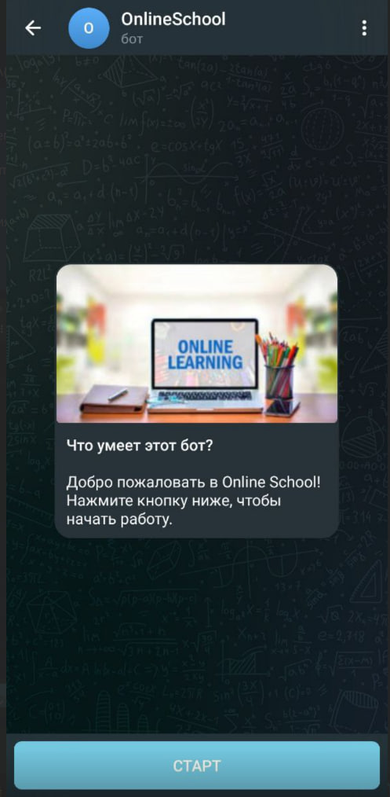
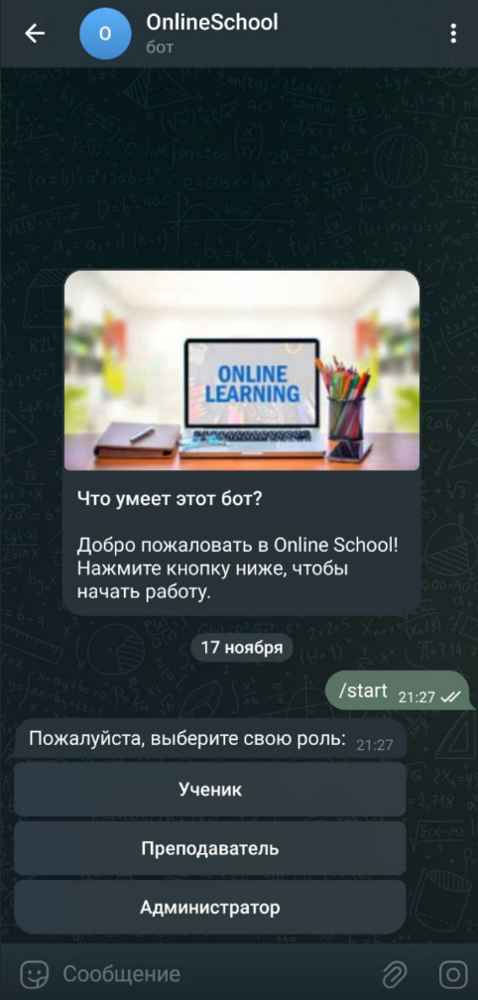
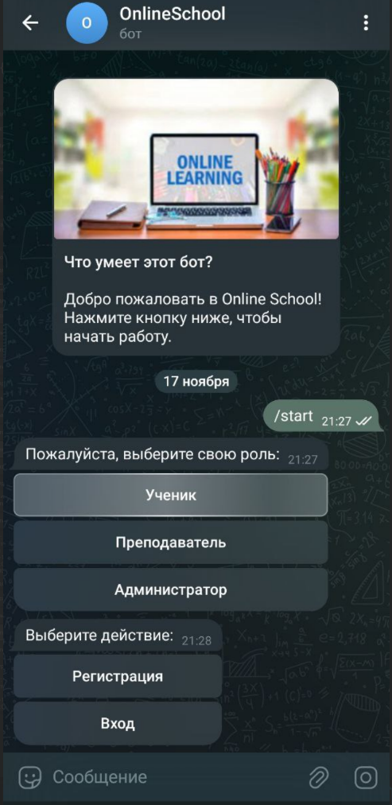
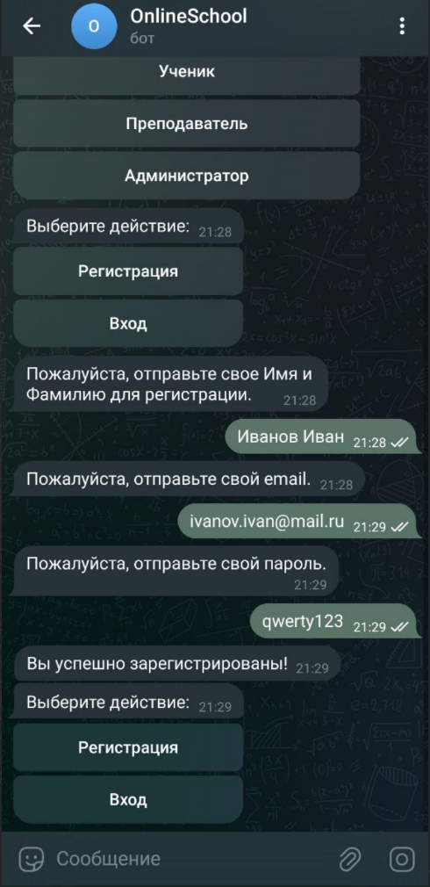
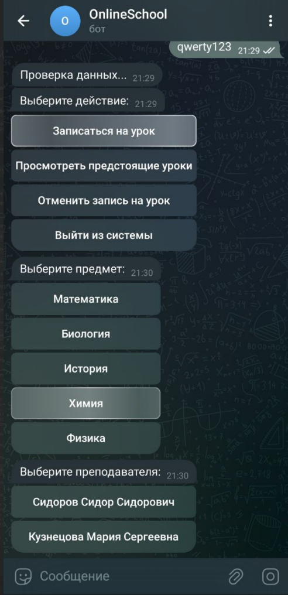
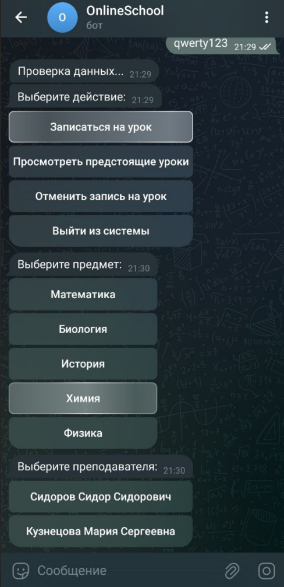
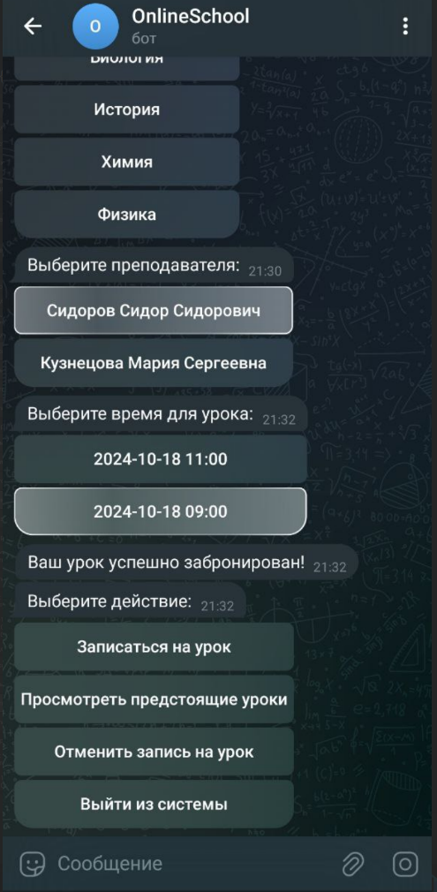
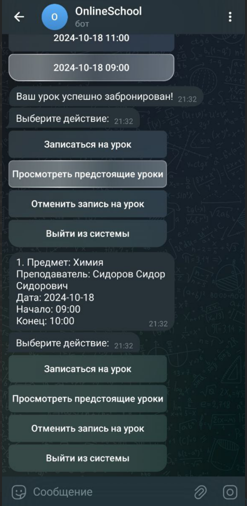
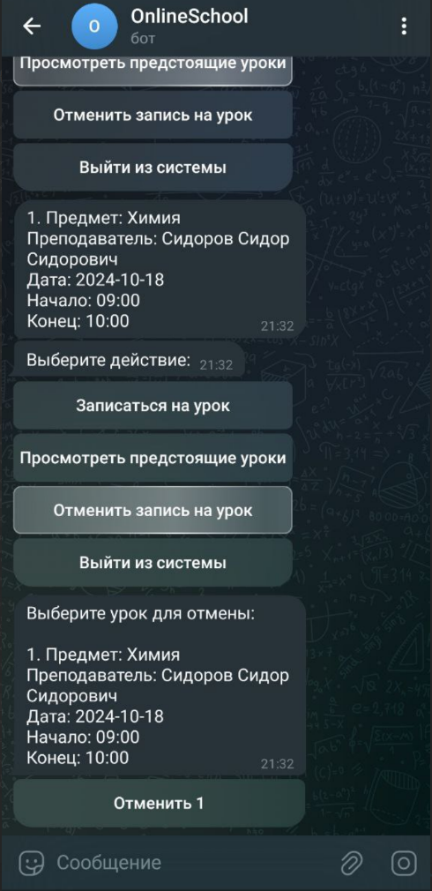
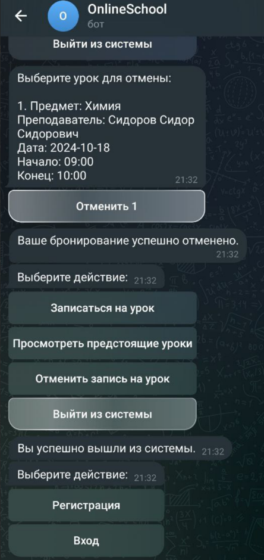

# Telegram Bot для Онлайн-Школы

## Описание
Данный проект представляет собой Telegram-бота для управления процессами в онлайн-школе. Бот разработан для упрощения взаимодействия между учениками и преподавателями, включая бронирование занятий, выбор предметов и преподавателей.

---

## Основные функции
Бот предоставляет пользователям следующие возможности:
- **Регистрация и вход:** Простая регистрация и авторизация через Telegram.
- **Выбор предмета и преподавателя:** Легкий способ выбрать предмет и преподавателя для занятий.
- **Бронирование занятий:** Возможность бронировать занятия с выбранным преподавателем.
- **Просмотр и отмена занятий:** Управление запланированными занятиями, включая просмотр расписания и отмену.

---

## Технологический стек
Проект использует следующие технологии и библиотеки:
- **Язык программирования:** Java 17.
- **Фреймворк:** Spring Boot 3.3.4.
- **Telegram API:** [TelegramBots](https://github.com/rubenlagus/TelegramBots) 6.9.7.
- **Сообщения:** Apache Kafka.
- **База данных:** PostgreSQL.
- **Миграция данных:** Liquibase.
- **Контейнеризация:** Docker.
- **Тестирование:** JUnit, Testcontainers, Rest Assured.
- **Утилиты и вспомогательные библиотеки:** Lombok, ModelMapper, Jackson.

---

## Архитектура проекта

Проект построен на базе микросервисной архитектуры и использует следующие компоненты:

### 1. **Telegram Bot**
Пользовательский интерфейс, который взаимодействует с пользователями через Telegram. Пользователи могут регистрироваться, выбирать преподавателей и бронировать занятия.

### 2. **User Service**
Микросервис для регистрации пользователей, аутентификации и управления профилем. Хранит информацию о пользователях, предметах и преподавателях.

### 3. **Booking Service**
Микросервис для управления расписанием и бронированием занятий. Обрабатывает запросы на бронирование и управление занятиями.

### 4. **Kafka**
Используется для асинхронного обмена сообщениями между микросервисами. Позволяет синхронизировать данные и уведомления о событиях (регистрация, бронирование) между сервисами.

### 5. **PostgreSQL**
Каждое приложение использует отдельную базу данных PostgreSQL для хранения данных. **User Service** хранит информацию о пользователях и их предпочтениях, **Booking Service** — информацию о занятиях и бронированиях.

### 6. **Environment Service (Docker Compose)**
Для удобства разработки и развертывания используется Docker Compose, который упрощает управление микросервисами, их зависимостями и настройкой среды. Включает конфигурацию для следующих сервисов:
- **User Service**
- **Telegram Bot**
- **Booking Service**
- **PostgreSQL**
- **Kafka**
---

## Взаимодействие компонентов

- **Telegram Bot** отправляет запросы в **User Service** для регистрации пользователей и выбора предметов и преподавателей.
- После выбора преподавателя, запросы на бронирование передаются в **Booking Service** для проверки доступности, получения расписания преподавателя и создания бронирования.
- **Booking Service** предоставляет расписания преподавателей, которые запрашиваются Telegram-ботом для отображения доступных временных слотов.
- Некоторые события (регистрация, бронирование) отправляются в **Kafka**, обеспечивая асинхронное взаимодействие между сервисами.
- Сервисы используют **PostgreSQL** для хранения данных о пользователях, преподавателях и занятиях.

---

## Как развернуть проект локально

Для развертывания проекта на локальной машине выполните следующие шаги:

### 1. Склонировать репозиторий
Клонируйте репозиторий с кодом проекта на вашу локальную машину:

```bash
git clone <URL>
```
### 2. Собрать образы Docker

Перейдите в корневую директорию проекта и выполните команду для сборки Docker-образов для всех сервисов:

```bash
./mvnw spring-boot:build-image
```

Эта команда соберет Docker-образы для всех сервисов, включая telegram-bot-service, user-service, и booking-service.

### 3. Запустить Docker Compose
После сборки образов выполните команду для запуска всех контейнеров с помощью Docker Compose. Это автоматически развернет все необходимые сервисы (PostgreSQL, Kafka, Zookeeper, и ваши микросервисы):

```bash
docker-compose up
```

Docker Compose создаст все необходимые контейнеры и подключит их в одну сеть.

### 4. Настроить Telegram-бота
В репозитории уже есть файл конфигурации application.yml с настройками для всех сервисов.
Однако, для корректной работы Telegram-бота нужно добавить ваш API-ключ.

Для этого выполните следующие шаги:
Откройте файл application.yml в сервисе telegram-bot-service и найдите строку:

```yaml
bot:
  name: OnlineSchool
  token: ${TELEGRAM_BOT_TOKEN}
```
В корне проекта создайте файл .env, если его нет, и добавьте в него ваш токен Telegram-бота:

```env
TELEGRAM_BOT_TOKEN=<your_telegram_bot_token>
```

Замените <your_telegram_bot_token> на настоящий токен, который вы получили при регистрации бота в Telegram.

Если вы не хотите использовать .env файл, вы можете вручную указать токен в файле application.yml, заменив ${TELEGRAM_BOT_TOKEN} на сам токен:

yaml
Копировать код
bot:
name: OnlineSchool
token: <your_telegram_bot_token>
### 5. Конфигурация Docker Compose
В файле docker-compose.yml уже настроены все необходимые сервисы (PostgreSQL, Kafka, Zookeeper, и микросервисы). Для корректной работы Telegram-бота также нужно указать токен в переменной окружения.

Откройте файл docker-compose.yml.

Найдите раздел для telegram-bot и добавьте следующую строку:

```yaml
telegram-bot:
  image: telegram-bot-service:latest
  depends_on:
    - kafka
  environment:
    SPRING_KAFKA_BOOTSTRAP_SERVERS: kafka:9092
    TELEGRAM_BOT_TOKEN: ${TELEGRAM_BOT_TOKEN}  # Убедитесь, что переменная задана в .env файле
    LANG: ru_RU.UTF-8
    LANGUAGE: ru_RU:ru
    LC_ALL: ru_RU.UTF-8
    JAVA_TOOL_OPTIONS: "-Dfile.encoding=UTF-8"
  ports:
    - 8443:8443
  networks:
    - corpbot-network
```
### 6. Запуск и проверка
После того как все шаги выполнены:

Запустите Docker Compose с помощью команды:

```bash
docker-compose up
```
Убедитесь, что все сервисы корректно запущены и работают.

В Telegram, найдите вашего бота и начните с ним взаимодействовать, чтобы проверить его функциональность.


## 7. Инструкция по использованию

Как начать работать с ботом в Telegram (показано на примере пользователя):

---

#### 1. Запустить бота командой `/start`
- Откройте Telegram и найдите вашего бота.
- Нажмите кнопку **Запустить** или введите команду `/start` в поле для сообщений.


---

#### 2. Выбрать роль пользователя
- После команды `/start`, бот предложит вам выбрать вашу роль. На данный момент доступна роль **пользователь**.
- Нажмите на кнопку с соответствующей ролью.



---

#### 3. Зарегистрироваться
- Если вы новый пользователь, выберите **Регистрация**.



- Введите следующие данные, когда бот запросит:
    - Имя и фамилия.
    - Электронная почта.
    - Пароль (должен соответствовать требованиям безопасности).



- Бот выполнит валидацию данных и сообщит, если найдены ошибки (например, неверный формат электронной почты или слишком простой пароль).


---

#### 4. Войти

- Если вы уже зарегистрированы, выберите **Вход**.
- Введите свою электронную почту и пароль.
- Бот проверит введенные данные и сообщит, если они неверны.


---

#### 5. Использовать команды для управления занятиями
После успешной регистрации или входа, вам будут доступны следующие команды:

1. **Бронировать занятие**:
    - Выберите кнопку **Бронировать занятие**.
    - Укажите предмет, выберите преподавателя и подходящее время.







2. **Просмотреть забронированные занятия**:
    - Нажмите на кнопку **Посмотреть занятия**.
    - Бот отобразит ваш список занятий.



3. **Отменить занятие**:
    - Нажмите кнопку **Отменить занятие**.
    - Выберите занятие, которое нужно отменить, из предложенного списка.





---

## 8. Планы на будущее

### 1. Расширение функциональности бота

В будущем проект будет ориентирован на полную интеграцию всех пользовательских ролей — **пользователя**, **администратора** и **преподавателя** — с Telegram-ботом. Это позволит каждому пользователю выполнять все необходимые действия прямо через интерфейс бота.  

### 2. Добавление кэширования
Для повышения производительности системы и снижения нагрузки на базу данных будет реализовано **кэширование**.  
Это ускорит обработку запросов, например:
- Быстрый доступ к расписанию.
- Часто запрашиваемая информация о пользователях, предметах и преподавателях.

Технологии, которые планируется использовать:
- **Redis** или другой высокоскоростной механизм кэширования.


### 3. Внедрение JWT-токенов
Для улучшения безопасности и удобства работы с системой будет внедрена **аутентификация на основе JWT (JSON Web Token)**.  
Это обеспечит:
- Надежный механизм авторизации для всех ролей.
- Возможность выполнения безопасных запросов через API.
- Простоту интеграции с ботом и другими потенциальными интерфейсами.

JWT-токены позволят поддерживать масштабируемость и гибкость системы, что особенно важно для многоуровневой архитектуры.

---
